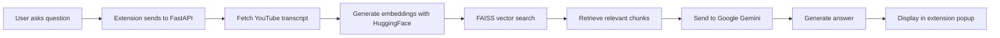

# 🎥 Dynamic YouTube Q&A Extension | AI-Powered Video Intelligence

[](https://fastapi.tiangolo.com/)
[](https://langchain.com/)
[](https://deepmind.google/technologies/gemini/)
[](https://developer.chrome.com/docs/extensions/)

> **Ask questions about ANY YouTube video and get instant AI-powered answers** 🚀  
> Supports Hindi & English transcripts | Smart semantic search | Clean, responsive UI

---

## 💡 What Problem Does This Solve?

Ever watched a long YouTube tutorial or lecture and wanted to quickly find specific information without rewatching the entire video? This extension lets you:

- 🔍 Ask specific questions about video content
- ⚡ Get instant, context-aware answers from AI
- 📚 Works with both **Hindi and English** transcripts
- 🎯 Extracts only relevant parts using vector similarity search
- 💬 Natural language understanding with Google Gemini

---

## 🚀 Key Features

### 🧠 **Intelligent Q&A**

- Fetches YouTube video transcripts automatically (Hindi + English)
- Dynamically builds embeddings for semantic search
- Retrieves most relevant transcript segments using FAISS
- Generates accurate, contextual answers with Google Gemini 2.5 Flash

### 🎨 **Clean User Experience**

- Responsive Chrome extension popup (360×480px)
- Large, readable fonts (18px base)
- Three-button interface: **Ask | Reset | Maximize**
- Auto-formatted, bulleted answers for easy reading
- Works seamlessly on any YouTube page

### ⚡ **Performance Optimized**

- Fast vector similarity search with FAISS
- Efficient transcript chunking for long videos
- Smart context window management
- Handles videos of any length

---

## 🛠️ Tech Stack

### **Frontend (Chrome Extension)**

| Technology           | Purpose                   |
| -------------------- | ------------------------- |
| HTML/CSS/JS          | Extension popup interface |
| Chrome Extension API | Browser integration       |
| Fetch API            | Backend communication     |

### **Backend (FastAPI + AI)**

| Technology               | Purpose                  | Version |
| ------------------------ | ------------------------ | ------- |
| FastAPI                  | REST API server          | Latest  |
| LangChain                | LLM orchestration        | 0.3+    |
| Google Gemini 2.5 Flash  | Question answering       | Latest  |
| FAISS                    | Vector similarity search | Latest  |
| HuggingFace Transformers | Text embeddings          | Latest  |
| YouTube Transcript API   | Transcript extraction    | Latest  |

---

## 📦 Project Structure

```
youtube-qa-extension/
│
├── backend/
│   ├── app.py              # FastAPI backend server
│   ├── requirements.txt    # Python dependencies
│   └── .env                # Environment variables (not in repo)
│
├── extension/
│   ├── manifest.json       # Chrome extension manifest
│   ├── popup.html          # Extension popup UI
│   ├── popup.css           # Styling
│   ├── popup.js            # Frontend logic
│   └── icons/              # Extension icons (optional)
│
└── README.md               # This file
```

---

## ⚙️ Installation & Setup

### 🔧 **Backend Setup**

#### 1️⃣ Clone the Repository

```bash
git clone https://github.com/<your-username>/youtube-qa-extension.git
cd youtube-qa-extension/backend
```

#### 2️⃣ Install Python Dependencies

```bash
pip install fastapi uvicorn youtube-transcript-api langchain langchain-community langchain-google-genai sentence-transformers faiss-cpu python-dotenv
```

Or use requirements.txt:

```bash
pip install -r requirements.txt
```

#### 3️⃣ Configure Google API Key

Create a `.env` file in the `backend/` folder:

```env
GOOGLE_API_KEY=your_google_gemini_api_key_here
```

**Get your API key:** [Google AI Studio](https://makersuite.google.com/app/apikey)

#### 4️⃣ Run the FastAPI Server

```bash
uvicorn app:app --reload
```

Server runs at: **http://127.0.0.1:8000**

API Docs: **http://127.0.0.1:8000/docs**

---

### 🌐 **Frontend Setup (Chrome Extension)**

#### 1️⃣ Navigate to Extension Folder

```bash
cd ../extension
```

#### 2️⃣ Load Extension in Chrome

1. Open Chrome and go to: `chrome://extensions/`
2. Enable **Developer mode** (top-right toggle)
3. Click **Load unpacked**
4. Select the `extension/` folder
5. Extension icon appears in your toolbar! 🎉

#### 3️⃣ Test the Extension

1. Go to any YouTube video
2. Click the extension icon
3. Enter the video ID (e.g., `dQw4w9WgXcQ`)
4. Type your question
5. Click **Ask** and get instant AI answers! ✨

---

## 📘 API Documentation

### **Health Check**

```http
GET /health
```

**Response:**

```json
{
  "status": "ok"
}
```

---

### **Ask Question**

```http
POST /ask
Content-Type: application/json
```

**Request Body:**

```json
{
  "video_id": "dQw4w9WgXcQ",
  "question": "What is the main topic of this video?"
}
```

**Response:**

```json
{
  "answer": "* The video discusses the concept of...\n* Key points include...\n* The speaker emphasizes..."
}
```

---

## 🧩 How It Works



1. **Transcript Extraction** → YouTube Transcript API fetches captions
2. **Text Chunking** → LangChain splits transcript into semantic chunks
3. **Embedding Generation** → HuggingFace Sentence Transformers create vectors
4. **Semantic Search** → FAISS finds most relevant chunks
5. **AI Generation** → Google Gemini generates contextual answer
6. **UI Display** → Extension shows formatted response

---

## 🎯 Example Usage

### Input:

```
Video ID: dQw4w9WgXcQ
Question: What are the key points discussed in the first 5 minutes?
```

### Output:

```
* The speaker introduces the main concept of...
* Three key principles are outlined:
  - First principle explanation
  - Second principle details
  - Third principle examples
* The importance of understanding these concepts is emphasized
```

---

## 🧰 Troubleshooting

| Issue                            | Solution                                                                              |
| -------------------------------- | ------------------------------------------------------------------------------------- |
| ❌ **Transcript not found**      | Video may not have captions. Try another video with auto-generated or manual captions |
| ⚠️ **500 Internal Server Error** | Check if your Google API key is valid and has quota remaining                         |
| 💤 **Slow response time**        | Large transcripts take longer. First-time embedding generation is slower              |
| 🔒 **CORS error**                | Ensure FastAPI CORS middleware allows `chrome-extension://` origins                   |
| 🚫 **Extension not loading**     | Verify `manifest.json` format and all required permissions                            |

---

## 🔮 Future Enhancements

- [ ] 📊 Add timestamp links to jump to specific video moments
- [ ] 🌍 Support for more languages (Spanish, French, German)
- [ ] 💾 Cache transcripts and embeddings for faster repeated queries
- [ ] 🎨 Dark mode UI theme
- [ ] 📝 Export Q&A history as PDF/Markdown
- [ ] 🔗 Share answers via social media
- [ ] 🎤 Voice input for questions
- [ ] 📱 Mobile browser extension support

---

## 🤝 Contributing

Contributions are welcome! Here's how you can help:

1. **Fork** the repository
2. **Create** a feature branch (`git checkout -b feature/AmazingFeature`)
3. **Commit** your changes (`git commit -m 'Add some AmazingFeature'`)
4. **Push** to the branch (`git push origin feature/AmazingFeature`)
5. **Open** a Pull Request

Please ensure your code follows the existing style and includes appropriate tests.

---

## 📄 License

This project is licensed under the **MIT License** – see the [LICENSE](LICENSE) file for details.

---

## 🧑‍💻 Author

**Gyanendra Singh**  
🎓 B.Tech ECE @ IIIT Una  
💡 Passionate about: IoT | Embedded Systems | Machine Learning | AI Assistants

[](https://linkedin.com/in/your-profile)
[](https://github.com/your-username)
[](https://twitter.com/your-handle)

---

## 💖 Acknowledgments

- Google Gemini for powerful LLM capabilities
- LangChain for seamless AI orchestration
- YouTube Transcript API for transcript access
- HuggingFace for excellent embedding models
- FastAPI for the blazing-fast backend framework

---

<div align="center">

**⭐ If this project helped you, consider giving it a star!**

Made with ❤️ and ☕ by Gyanendra Singh

_"Making YouTube knowledge accessible through AI, one question at a time."_

</div>
